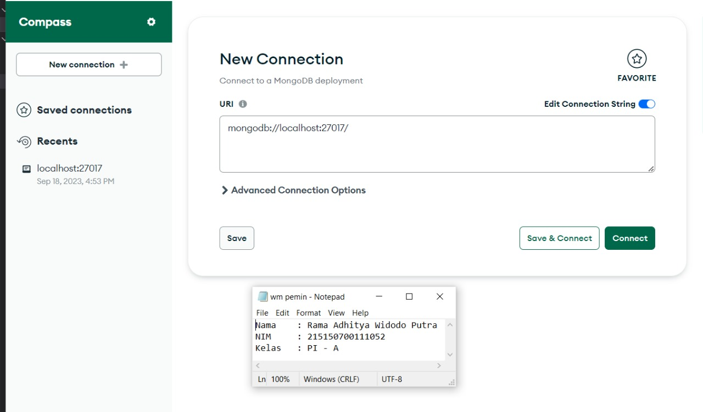
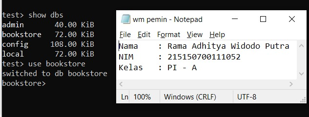

# Proses CRUD Pada MongoDB Compass dan MongoDB Shell

* ## MongoDB Compass
  MongoDB Compass merupakan alat bantu berbasis GUI yang digunakan untuk melakukan operasi CRUD tanpa harus menggunakan command line. Dengan menggunakan MongoDB Compass, kita dapat melakukan analisis dan kueri data dalam lingkungan visual. Di bawah ini merupakan langkah-langkah untuk melakukan operasi CRUD pada MongoDB Compass: <br>
  a. Melakukan koneksi ke MongoDB <br>
      <br>
  b. Setelah berhasil melakukan koneksi, maka akan muncul gambar di bawah ini: <br>
      <br>
  c. Klik tombol "Create Database" yang ada di bagian atas. Setelah di-klik, MongoDB Compass akan menampilkan sebuah form dan isikan data sesuai kebutuhan. Setelah form terisi, tekan tombol "Create Database" di bagian kanan bawah form <br>
      <br>

### Create Data
  d. Untuk menjalankan proses CREATE, klik tombol "Add Data" dan pilih opsi "Insert Document". Setelah muncul kotak isian untuk insert dokumen, isi form tersebut sesuai kebutuhan dan tekan tombol "Insert" pada form tersebut <br>
      <br>
  e. Lakukan hal yang sama untuk buku kedua <br>
      <br>
### Read Data
  f. Kita dapat melakukan operasi READ dengan cara mengisi kolom filter sesuai kebutuhan kita. Semisal kita ingin mencari buku dengan author "Osamu Dazai", kita dapat mengisi parameter yang diinginkan dan klik "Find" <br>
      <br>
### Update Data
  g. Untuk proses UPDATE, kita dapa mengubah summary buku "No Longer Human" menjadi "Buku yang bagus (NAMA,NIM) dengan cara klik "Edit Document" (berlambang pensil), mengisi nilai summary yang baru, dan klik "Update" <br>
      <br>
### Delete Data
  h. Untuk melakukan DELETE, dapat dilakukan dengan cara klik "Remove Document" (berlambang tong sampah) dan melakukan klik "Delete". Misalnya pada buku "I Am a Cat" seperti berikut: <br>
      <br>
     
* ## MongoDB Shell
  MongoDB Shell merupakan tool untuk melakukan operasi CRUD yang berbasis Command Line Interface. MongoDB Shell dapat diakses langsung dari MongoDB Compass atau menggunakan perintah "mongosh" pada Command Prompt. Berbeda dengan MongoDB Compass yang dapat menampilkan data dalam lingkungan visual, dalam MongoDB Shell kita hanya dapat melakukan operasi dengan mengetik perintah. Berikut adalah langkah-langkah untuk melakukan CRUD pada MongoDB Shell: <br>
  a. Menjalankan command ```mongosh``` pada cmd untuk melakukan koneksi dengan MongoDB <br>
      <br>
  b. Melihat list database dengan menjalankan command ```show dbs``` <br>
      <br>
  c. Untuk berpindah ke database "bookstore", jalankan command ```use bookstore``` <br>
      <br>
  d. Untuk melihat collection, jalankan command ```show collection``` <br>
      <br>
  ### Create Data
  e. Untuk CREATE data pada MongoDB Shell, jika kita ingin menambah satu objek baru (misalnya buku "Overlord I"), kita dapat menjalankan command ```db.books.insertOne(data)``` <br>
      <br>
  f. Jika kita ingin membuat objek baru lebih dari satu (misalnya buku "The Setting Sun" dan "Hujan"), kita dapat melakukannya dengan menjalankan command ```db.books.insertMany(data)``` <br>
      <br>
  ### Read Data
  g. Untuk melakukan operasi READ, caranya adalah menjalankan command ```db.books.find()``` untuk melakukan pencarian semua buku yang ada pada database <br>
      <br>
  h. Untuk menampilkan buku dengan parameter tertentu (misalnya dengan author "Osamu Dazai"), kita dapat mengisi argument pada "find()" seperti berikut: ```db.books.find({filter})``` <br>
      <br>
  ### Update Data
  i. Untuk operasi UPDATE dapat dilakukan dengan menjalankan command ```db.books.updateOne({filter}, {$set: {data yang ingin diupdate}})```. Contohnya sebagai berikut: <br>
      <br>
  j. Kita juga dapat melakukan perubahan pada semua buku dengan parameter tertentu dengan menjalankan command ```db.books.updateMany({filter}, {$set: {data yang ingin diupdate}})```. Misalnya kita ingin mengubah publihser pada buku dengan author "Osamu Dazai", kita dapat menjalankan perintah berikut:<br>
      <br>
  ### Delete Data
  k. Untuk proses DELETE, kita dapat menghapus sebuah objek dengan menjalankan command ```db.books.deleteOne({argument})``` <br>
      <br>
  l. Untuk menghapus semua buku dengan parameter tertentu, kita dapat menjalankan command ```db.books.deleteMany({argument})```. Contohnya pada gambar berikut: <br>
      <br>
  Untuk memastikan hasil dari proses CRUD, kita dapat melakukan list seluruh buku dengan command ```db.books.find()``` atau buku tertentu saja dengan command ```db.books.find(argument)```
      <br>