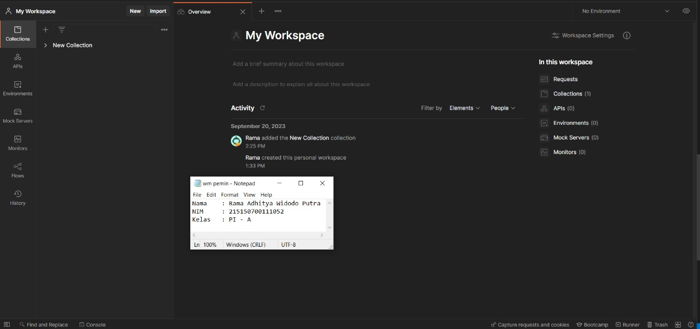
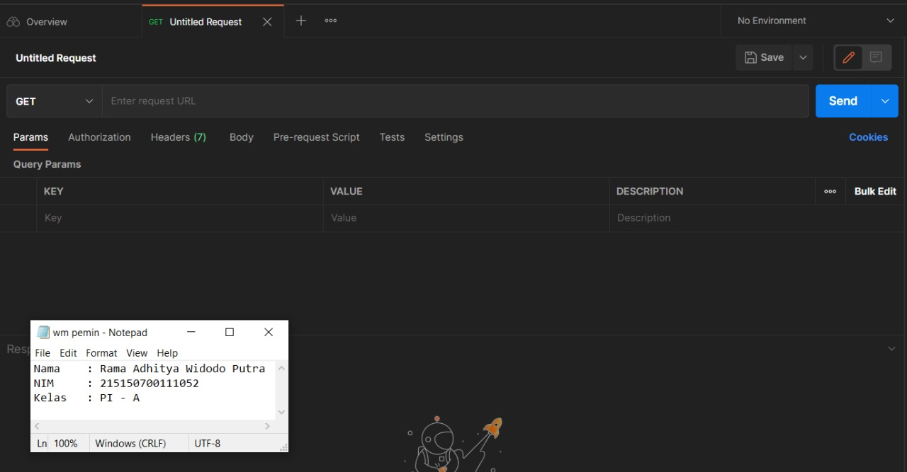

# Dasar Teori

## Basic Routing
Routing mengacu kepada bagaimana sebuah aplikasi merespon sebuah request dari klien yang ingin berpindah ke endpoint tertentu.

## Migration
Database Migration merupakan proses memindahkan data dari suatu sumber database ke satu atau lebih database tujuan.

# Langkah Percobaan
  1. GET <br>
  Untuk menambahkan endpoint dengan method GET pada aplikasi kita, kita dapat mengunjungi file web.php pada folder routes. Kemudian tambahkan baris ini pada akhir file <br>
      ```javascript
      ...
      $router->get('/get', function () {
      return 'GET';
      });
      ```
      <br>
      Setelah itu coba jalankan aplikasi dengan command,<br>

      ```
      php -S localhost:8000 -t public
      ```
      <br>
      <br>

  2. POST, PUT, PATCH, DELETE, dan OPTIONS <br>
  Sama halnya saat menambahkan method GET, kita dapat menambahkan methode POST, PUT, PATCH, DELETE, dan OPTIONS pada file web.php dengan code seperti ini,<br>

      ```javascript
      ...
      $router->post('/post', function () {
      return 'POST';
      });
      $router->put('/put', function () {
      return 'PUT';
      });
      $router->patch('/patch', function () {
      return 'PATCH';
      });
      $router->delete('/delete', function () {
      return 'DELETE';
      });
      $router->options('/options', function () {
      return 'OPTIONS';
      });
      ```
      <br>

      Setelah selesai menambahkan route untuk method POST, PUT, PATCH, DELETE, dan OPTIONS, kita dapat menjalankan server seperti pada saat percobaan GET. Setelah server berhasil menyala, kita dapat membuka aplikasi <u>Postman</u> atau <u>Insomnia</u> atau kita juga dapat menggunakan PowerShell (Windows) / Terminal (Linux atau Mac) untuk melakukan request ke server. Kita juga dapat menggunakan ekstensi <u>Thunder Client</u> pada VSCode, tetapi pada percobaan kali ini kita akan menggunakan postman.<br>

  - Buka aplikasi Postman. <br>
  <br>
  - Membuat request dengan menekan tombol "+" di bawah kolom search. <br>
  <br>
  - Setelah itu kita dapat memasukkan method dan url yang dituju. <br>
  <br>
  <br><br>

  3. Migrasi Database<br>
  - Sebelum melakukan migrasi database pastikan server database aktif kemudian pastikan sudah membuat database dengan nama ```lumenapi``` <br>
  <br>

  - Kemudian ubah konfigurasi database pada file .env   menjadi seperti ini <br>
      ```javascript
      DB_CONNECTION=mysql
      DB_HOST=127.0.0.1
      DB_PORT=3306
      DB_DATABASE=lumenapi
      DB_USERNAME=root
      DB_PASSWORD=<<password masing-masing>>
      ```
      <br>

  - Setelah mengubah konfigurasi pada file .env, kita juga perlu menghidupkan beberapa library bawaan dari lumen dengan membuka file app.php pada folder bootstrap dan mengubah baris ini, <br>
      ```javascript
      //$app->withFacades();
      //$app->withEloquent();
      ```
      Menjadi, <br>
      ```javascript
      $app->withFacades();
      $app->withEloquent();
      ```
       <br>
  - Setelah itu jalankan command berikut untuk membuat file migration,<br>
      ```javascript
      php artisan make:migration create_users_table # membuat migrasi untuk tabel users

      php artisan make:migration create_products_table # membuat migrasi untuk tabel products
      ```
       <br>

      Setelah menjalankan 2 syntax diatas akan terbuat 2 file pada folder ```database/migrations``` dengan format YYYY_MM_DD_HHmmss_nama_migrasi. Pada file migrasi kita akan menemukan fungsi up() dan fungsi down(), fungsi up() akan digunakan pada saat kita melakukan migrasi, fungsi down() akan digunakan saat kita ingin me-rollback migrasi. <br>

  - Ubah fungsi up pada file migrasi ```create_users_table``` <br>
    ```javascript
    # sebelumnya
    ...
      public function up()
      {
        Schema::create('users', function (Blueprint $table) {
        $table->id();
        $table->timestamps();
        });
      }
      ...
      # diubah menjadi
      ...
      public function up()
      {
        Schema::create('users', function (Blueprint $table) {
        $table->id();
        $table->timestamps();
        $table->string('name');
        $table->string('email');
        $table->string('password');
        });
      }
    ...
    ```
     <br>

- Ubah fungsi up pada file migrasi ```create_products_table``` <br>
  ```javascript
  # sebelumnya
  ...
    public function up()
    {
      Schema::create('products', function (Blueprint $table) {
        $table->id();
        $table->timestamps();
      });
    }
    ...
    # diubah menjadi
    ...
      public function up()
      {
        Schema::create('products', function (Blueprint $table) {
          $table->id();
          $table->timestamps();
          $table->string('name');
          $table->integer('category_id');
          $table->string('slug');
          $table->integer('price');
          $table->integer('weight');
          $table->text('description');
        });
      }
    ...
  ```
   <br>

- Kemudian jalankan command,
    ```javascript
    php artisan migrate
    ```
     <br>

    Berikut adalah tampilan pada database admin saat migrasi telah berhasil: <br>
    <br>